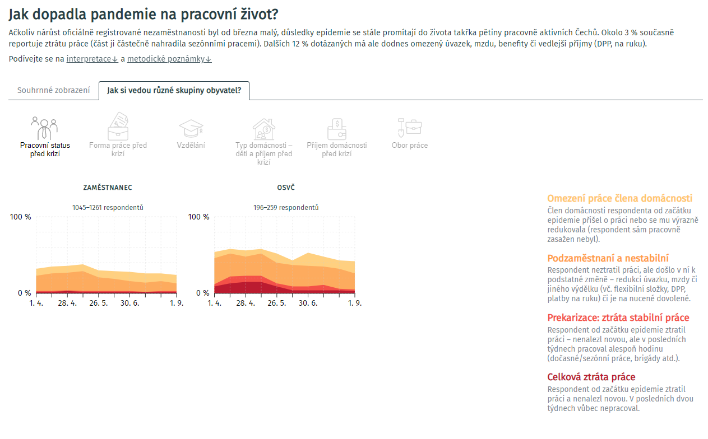

# Web application `Život během pandemie`

Data visualization application for research `Život během pandemie` (by [PAQ Research](https://www.paqresearch.cz/)).

[Život během pandemie](https://zivotbehempandemie.cz/)



## Authors

### Data

[PAQ Research](https://www.paqresearch.cz/)

### Data visualization and design

[Kristi Zákopčanová](https://github.com/kikinna)

### Web application

[Miroslav Veith](https://github.com/mveith/)

## Technologies

Developed with [Next.js](https://nextjs.org/) - The React Framework.

Running on [Vercel](https://vercel.com) - Develop. Preview. Ship.

Visualized with [Semiotic](https://semiotic.nteract.io/) - a data visualization framework for React.

## Development

First, run the development server:

```bash
npm run dev
# or
yarn dev
```

Open [http://localhost:3000](http://localhost:3000) with your browser to see the result.

You also need data - create `.env` file:

```env
PAQ_DATA_PATH=..data_path..
```

Sample data file: WIP.

Lear more: [Next.js Documentation](https://nextjs.org/docs).
